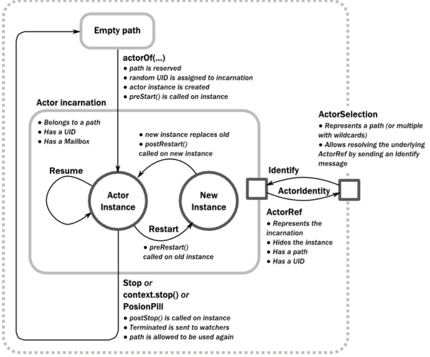

* 目录
{:toc}

### 依赖

注意是akka-actor，不是scala-actors
```scala
libraryDependencies += "com.typesafe.akka" %% "akka-actor" % "2.5.25"
```

### 创建actor

Akka强制执行家长监督，每个actor都受到监督，而且（潜在的）监督其子女

#### 定义Actor类

actor通过扩展Actor基本特质和实现receive方法来实现。receive方法应该定义一系列case语句（其类型为PartialFunction[Any，Unit]），使用标准Scala模式匹配定义您的Actor可以处理哪些消息，以及应该如何处理消息的实现。


```scala
import akka.actor.Actor
import akka.actor.Props
import akka.event.Logging

class MyActor extends Actor {
  val log = Logging(context.system, this)

  def receive = {
    case "test" => log.info("received test")
    case _      => log.info("received unknown message")
  }
}
```

Akka actor的receive message消息匹配的遍历是彻底的，与Erlang和Scala Actors（已废弃）不同。这意味着您需要为它可以接受的所有消息提供模式匹配，如果您希望能够处理未知的消息，那么您需要有一个默认的case，如上面的示例所示。
否则akka.actor.UnhandledMessage(message, sender, recipient)将发布到ActorSystem的EventStream。
上面定义的行为的返回类型是Unit，如果actor应回复所收到的消息，则必须按照下文解释明确地这样做。receive方法的结果是一个部分函数对象，该对象作为其“初始行为”存储在actor中。

以下是一个例子：

```scala
import akka.actor.{ Actor, ActorRef, ActorSystem, PoisonPill, Props }
import language.postfixOps
import scala.concurrent.duration._

case object Ping
case object Pong

class Pinger extends Actor {
  var countDown = 100

  def receive = {
    case Pong =>
      println(s"${self.path} received pong, count down $countDown")

      if (countDown > 0) {
        countDown -= 1
        sender() ! Ping
      } else {
        sender() ! PoisonPill
        self ! PoisonPill
      }
  }
}

class Ponger(pinger: ActorRef) extends Actor {
  def receive = {
    case Ping =>
      println(s"${self.path} received ping")
      pinger ! Pong
  }
}

    val system = ActorSystem("pingpong")

    val pinger = system.actorOf(Props[Pinger], "pinger")

    val ponger = system.actorOf(Props(classOf[Ponger], pinger), "ponger")

    import system.dispatcher
    system.scheduler.scheduleOnce(500 millis) {
      ponger ! Ping
    }
```

#### Props使用

Props是一个配置类，用于指定创建actor的选项，将其看作是不可变的，因此可以自由地共享创建一个actor的配方。下面是一些如何创建Props实例的例子。

```scala
import akka.actor.Props

val props1 = Props[MyActor]
val props2 = Props(new ActorWithArgs("arg")) // careful, see below
val props3 = Props(classOf[ActorWithArgs], "arg") // no support for value class arguments
```

第二个变体显示如何将构造函数参数传递给正在创建的actor，但它只应在行为者之外使用，如下所述。

最后一行显示了传递构造函数参数的可能性，而不管它在哪个上下文中使用。在Props对象的构造过程中，将验证匹配构造函数的存在，如果找不到或找到多个匹配的构造函数，则会导致IllegalArgumentException。

#### 用Props创建actor

```scala
import akka.actor.ActorSystem

// ActorSystem is a heavy object: create only one per application
val system = ActorSystem("mySystem")
val myActor = system.actorOf(Props[MyActor], "myactor2")
```

使用ActorSystem将创建顶级actor，由actor系统的监护人提供监督，而使用actor的上下文将创造出一个子actor。

```scala
class FirstActor extends Actor {
  val child = context.actorOf(Props[MyActor], name = "myChild")
  def receive = {
    case x => sender() ! x
  }
}
```

对ActorOf的调用返回ActorRef的一个实例。这是actor实例的句柄，也是与其交互的唯一方法。ActorRef是不可变的，并且与它所代表的actor有一对一的关系。
ActorRef也是可序列化和网络感知的。这意味着您可以序列化它，通过线路发送它，并在远程主机上使用它，它仍然代表着网络上原始节点上的同一个actor。

#### 值类作为构造函数参数

实例化actor props的推荐方法是在运行时使用反射来确定要调用的正确的actor构造函数，并且由于技术上的限制，当所述构造函数接受属于值类的参数时，不支持这种方法。
在这些情况下，您应该打开参数包装，或者通过手动调用构造函数来创建props：

```scala
class Argument(val value: String) extends AnyVal
class ValueClassActor(arg: Argument) extends Actor {
  def receive = { case _ => () }
}

object ValueClassActor {
  def props1(arg: Argument) = Props(classOf[ValueClassActor], arg) // fails at runtime
  def props2(arg: Argument) = Props(classOf[ValueClassActor], arg.value) // ok
  def props3(arg: Argument) = Props(new ValueClassActor(arg)) // ok
}
```

#### 依赖注入

如果您的actor有一个接受参数的构造函数，那么这些参数也需要作为props的一部分，如前所述。
但是，在某些情况下，必须使用工厂方法，例如，实际的构造函数参数由依赖项注入框架确定。

```scala
import akka.actor.IndirectActorProducer

class DependencyInjector(applicationContext: AnyRef, beanName: String) extends IndirectActorProducer {

  override def actorClass = classOf[Actor]
  override def produce =
    new Echo(beanName)

  def this(beanName: String) = this("", beanName)
}

val actorRef = system.actorOf(Props(classOf[DependencyInjector], applicationContext, "hello"), "helloBean")
```

有时，您可能会想提供一个IndirectActorProducer，它总是返回相同的实例，例如使用惰性val。
这是不支持的，因为它违背了actor重新启动的含义。

当使用依赖项注入框架时，actor bean不能有单例作用域。

#### 收件箱（信箱）

当编写与actor通信的外部代码时，ask模式可以是解决方案（见下文），但它不能做两件事：接收多个答复（例如，通过订阅ActorRef）和监视其他actor的生命周期。为此目的，有Inbox class：

```scala
import akka.actor.ActorDSL._

implicit val i = inbox()
echo ! "hello"
i.receive() should ===("hello")
```

有一个从收件箱到actor引用的隐式转换，这意味着在本例中，发送方引用将是隐藏在收件箱中的actor的引用。这允许在最后一行接收答复。看actor也很简单：

```scala
val target = // some actor
val i = inbox()
i.watch(target)
```

### 消息

#### 发送消息

通过下列方法之一向Actor发送消息。

* ! 意思是“触发和遗忘”，例如异步发送消息并立即返回。又称tell
* ? 异步发送消息并返回Future代表可能的答复。又称ask

这是发送消息的首选方式，不要阻塞等待消息，因为这提供了最佳的并发性和可伸缩性特征。

```scala
actorRef ! message
```

如果从Actor内部调用，则发送者actor的引用将与消息一起隐式传递，并在其sender(): ActorRef成员方法中对目标actor可用，接受者可用它来回复原始发送方，方法是sender() ! replyMsg

#### 接收消息

actor必须实现receive方法来接收消息：

```scala
type Receive = PartialFunction[Any, Unit]

def receive: Actor.Receive
```

此方法返回PartialFunction，例如，使用Scala模式匹配将消息与不同的case子句相匹配的“Match/case”子句。以下是一个例子：

```scala
import akka.actor.Actor
import akka.actor.Props
import akka.event.Logging

class MyActor extends Actor {
  val log = Logging(context.system, this)

  def receive = {
    case "test" => log.info("received test")
    case _      => log.info("received unknown message")
  }
}
```

#### 回复消息

如果您想拥有回复消息的句柄，可以使用sender() ，这给了你一个actor的ActorRef。您可以通过向ActorRef发送sender() ! replyMsg。
您还可以存储ActorRef，以便稍后回复，或传递给其他actor。如果没有发送者（消息是在没有actor或Future上下文的情况下发送的），则发送方默认为“死信”actor引用。

```scala
sender() ! x // replies will go to this actor
```

#### 接收超时

这个ActorContext setReceiveTimeout定义非活动超时，然后发送ReceiveTimeout信息被触发。
指定时，接收函数应该能够处理akka.actor.ReceiveTimeout留言。1毫秒是支持的最小超时。

> 请注意，接收超时可能会在另一条消息排队后立即触发并排队ReceiveTimeout消息；因此，不能保证在接收超时，一定有通过此方法配置的空闲期间。
一旦设置，接收超时将保持有效（即在不活动期间后继续重复触发）。传入Duration.Undefined关闭此功能。

```scala
import akka.actor.ReceiveTimeout
import scala.concurrent.duration._
class MyActor extends Actor {
  // To set an initial delay
  context.setReceiveTimeout(30 milliseconds)
  def receive = {
    case "Hello" =>
      // To set in a response to a message
      context.setReceiveTimeout(100 milliseconds)
    case ReceiveTimeout =>
      // To turn it off
      context.setReceiveTimeout(Duration.Undefined)
      throw new RuntimeException("Receive timed out")
  }
}
```

#### 定时器与定期消息

可以将消息计划在以后的某个点发送，方法是使用调度器，但是当在一个actor中调度周期性或单个消息时，使用对命名计时器的支持是更方便和安全的。
当actor重新启动并由定时器处理时，调度消息的生命周期可能很难管理。

```scala
import scala.concurrent.duration._

import akka.actor.Actor
import akka.actor.Timers

object MyActor {
  private case object TickKey
  private case object FirstTick
  private case object Tick
}

class MyActor extends Actor with Timers {
  import MyActor._
  timers.startSingleTimer(TickKey, FirstTick, 500.millis)

  def receive = {
    case FirstTick =>
      // do something useful here
      timers.startPeriodicTimer(TickKey, Tick, 1.second)
    case Tick =>
    // do something useful here
  }
}
```

每个定时器都有一个键，可以替换或取消。保证不会接收来自具有相同密钥的定时器上一次投递的消息，它可能已经在邮箱中排队，即使在取消或启动新计时器时。

定时器被绑定到拥有它的actor的生命周期中，因此在重新启动或停止时会自动取消。注意，TimerScheduler不是线程安全的，也就是说它只能在拥有它的actor中使用。几种定时器的比较参考本博客（“其他”分类中的三种定时器的使用），其中包括ActorSystem的定时器。

### 初始化模式

#### 通过构造函数初始化

使用构造函数进行初始化有各种好处。首先，使用val字段存储在actor实例生命周期内不发生更改的任何状态成为可能，从而使actor的实现更加健壮。
当调用actorOf创建actor实例和重新启动时，就会调用该构造函数，因此，该actor的内部总是可以假定发生了适当的初始化。这也是这种方法的缺点，因为在某些情况下，人们希望避免在重启时重新初始化内部。例如，在重启过程中保持子角色通常是有用的。下面提供了这种情况的case。

#### 通过预启动初始化

在初始化第一个实例时，即在创建ActorRef时，只直接调用actor的方法prestart()一次。在重新启动的情况下，从postRestart()调用prestart()，因此如果不重写，
则在每次重新启动时调用prestart()。但是，通过重写postRestart()，可以禁用此行为，并确保只有一个对prestart()的调用。

此模式的一个有用用法是在重新启动期间禁用为子级创建新ActorRefs。这可以通过重写preRestart()来实现。下面是这些生命周期挂钩的默认实现：

```scala
override def preStart(): Unit = {
  // Initialize children here
}

// Overriding postRestart to disable the call to preStart()
// after restarts
override def postRestart(reason: Throwable): Unit = ()

// The default implementation of preRestart() stops all the children
// of the actor. To opt-out from stopping the children, we
// have to override preRestart()
override def preRestart(reason: Throwable, message: Option[Any]): Unit = {
  // Keep the call to postStop(), but no stopping of children
  postStop()
}
```

> 请注意，子角色仍在重新启动，但没有创建新的ActorRef。我们可以递归地对子元素应用相同的原则，确保它们的prestart()方法只有在创建它们的refs时才被调用。

#### 通过消息传递初始化

在某些情况下，不可能在构造函数中传递actor初始化所需的所有信息，例如在循环依赖项存在时。
在这种情况下，actor应该侦听初始化消息，并使用become()或有限状态机【State(S) x Event(E) -> Actions (A), State(S’)】状态转换来对actor的初始化状态和未初始化状态进行编码。

```scala
var initializeMe: Option[String] = None

override def receive = {
  case "init" =>
    initializeMe = Some("Up and running")
    context.become(initialized, discardOld = true)

}

def initialized: Receive = {
  case "U OK?" => initializeMe.foreach { sender() ! _ }

```

如果actor可能在消息被初始化之前接收消息，则可以使用一个有用的工具来保存消息，直到初始化完成为止，然后在actor初始化后重新回复它们。

actor生命周期：



### actor与异常

当消息正在由actor处理时，可能会引发某种类型的异常，例如数据库异常等。

通过重写监督方法可以对异常进行必要的处理，下面是一个简单的例子：


```scala
  //AllForOneStrategy，影响同级或同层所有actor
  override def supervisorStrategy: SupervisorStrategy = AllForOneStrategy(maxNrOfRetries = 5, Duration.create("1 minute"), true) {

        //索引是IO操作，挂了就停止
        case _: IndexingException => Escalate
        
        //重启，Restart不保留状态，重新抓取页面
        case re: RetrievalException => {
            if (re.url != null) {
                logger.warn("url {} has an exception", re.url)
                VisitedPageStore.finished(re.url)
            }
            Resume
        }
        //代理异常，忽略
        case pe: ProxyException => {
            if (pe.url != null) {
                logger.warn("url {} has an exception", pe.url)
                VisitedPageStore.finished(pe.url)
            }
            Escalate
        }
        //其他异常
        case _: Exception => Stop
    }
```

##### 对于消息来说发生了什么

如果在处理消息时抛出异常，则此消息将丢失。
重要的是要明白，它没有放回邮箱。因此，如果您想要重新尝试处理一条消息，您需要自己处理它，捕捉异常并重试您的流。
确保您绑定了重试次数，因为您不希望系统发生活锁（这样就会消耗大量的CPU周期而不会取得有意义的进展）。

##### 对于信箱（邮箱）来说发生了什么

如果在处理消息时引发异常，则邮箱不会发生任何情况。如果重新启动该actor，则将存在相同的邮箱。所以邮箱上的所有信息（消息）都会在那里而不会丢失。

##### 对于actor来说发生了什么

如果actor中的代码抛出异常，则暂停该actor并启动监视过程（请参阅监督与监控）。
这取决于主管（上级）actor的决定，actor可以被恢复（好像什么都没发生）、也可以被重新启动（清除内部状态并从头开始）或者被终止。

### 其他

其他特性代码，没有翻译。[Akka-actor examples](https://github.com/jxnu-liguobin/scala-examples/tree/master/scala-akka/src/main/scala/io/growing/akka/actor)

* Become_Actor.scala
* PartialFunction_Actor.scala
* Schedule_Actor.scala
* Selection_Actor.scala
* Stash_Actor.scala
* Stop_Actor.scala
* Watch_Actor.scala

[文档](https://doc.akka.io/docs/akka/current/actors.html)

* 使用搜狗翻译、百度翻译、谷歌翻译，仅供参考
* 来自官方文档、参考《响应式架构 消息模式Actor实现与Scala、Akka应用集成》
* 后续随着理解深入会继续修改错误和描述，以便更好理解，本博客开源，欢迎指出错误