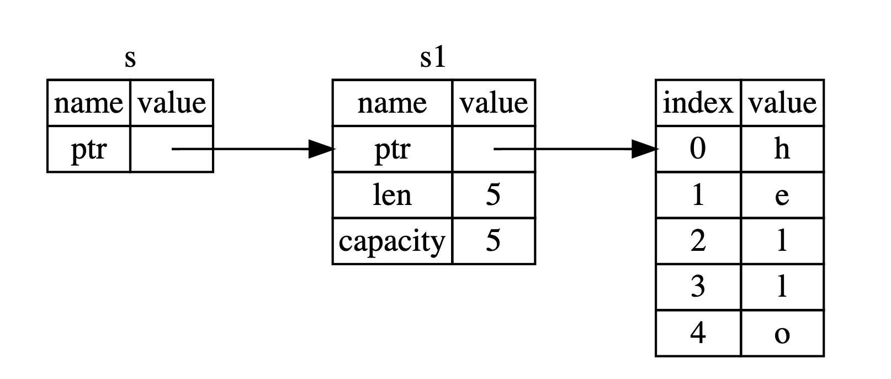

* 目录
{:toc}

# 引用和出借

前面所有权部分，最后一个例子，我们必须将String返回给调用函数，因此我们仍然可以在调用calculate_length之后使用String。因为该字符串已被移入calculate_length函数。
出借就是借用的意思（borrow）。

下面将演示您将如何定义和使用对象的引用作为calculate_length函数的参数，而不是获取值的所有权

```rust
fn main() {
    let s1 = String::from("hello");
    //类似c/c++传递指针/引用
    let len = calculate_length(&s1);
    //s1在之后还能使用
    println!("The length of '{}' is {}.", s1, len);
}

fn calculate_length(s: &String) -> usize {
    s.len()
}
```

首先，请注意，变量声明和函数返回值中的所有元组代码都消失了。其次，请注意，我们将＆s1传递给calculate_length，并且在其定义中，我们采用＆String而不是String。

这些&符号是引用（指针，下面引用都可以认为是指针），它们使您可以引用某些值而无需拥有所有权。下面是一个示意图



&String s 指向 String s1

> 与＆相反的是取消引用，这是通过运算符*完成的。这里与c指针用法类似。

让我们仔细看看这里的函数调用

```rust
let s1 = String::from("hello");

let len = calculate_length(&s1);
```

通过＆s1语法，我们可以创建引用s1的引用，但该引用不属于s1。因为它不拥有它，所以当引用超出范围时，它所指向的值将不会被删除。

同样，函数的签名使用＆表示参数s的类型是引用。让我们添加一些说明性注释

```rust
fn calculate_length(s: &String) -> usize { // s是对字符串的引用
    s.len()
} // 在这里，s超出范围。但是因为它没有什么所有权，所以它没有发生什么。
```

变量s有效的作用域与任何函数参数的作用域相同，但是当它超出作用域时，由于没有所有权，我们不会删除引用指向的内容。当函数使用引用作为参数而不是实际值作为参数时，我们将不需要返回这些值来归还所有权，因为我们从未拥有过所有权。

我们称拥有引用为函数参数借用。与现实生活中一样，如果某人拥有某物，则可以向他们借用。完成后，您必须将其归还。

那么，如果我们尝试修改要借用的内容会怎样？

```rust
fn main() {
    let s = String::from("hello");

    change(&s);
}

fn change(some_string: &String) {
    some_string.push_str(", world");
}
```

尝试修改借的值将会报错

```
error[E0596]: cannot borrow immutable borrowed content `*some_string` as mutable
 --> error.rs:8:5
  |
7 | fn change(some_string: &String) {
  |                        ------- use `&mut String` here to make mutable
8 |     some_string.push_str(", world");
  |     ^^^^^^^^^^^ cannot borrow as mutable
```

正如变量在默认情况下是不可变的一样，引用也是如此。我们不允许修改引用的内容。如果非要改则需要使用&mut String。

## 可变引用

我们只需稍作调整就可以解决上面的编译错误。

```rust
fn main() {
    let mut s = String::from("hello");

    change(&mut s);
}

fn change(some_string: &mut String) {
    some_string.push_str(", world");
}
```

首先，我们必须将s更改为mut。然后，我们必须使用＆mut s创建一个可变引用，并使用some_string: ＆mut String接受一个可变引用。

但是可变引用有一个很大的限制：您只能在一个特定范围内对一个特定的数据进行一个可变引用。此代码将会失败：

```rust
let mut s = String::from("hello");

let r1 = &mut s;
let r2 = &mut s;//可变引用只能被出借一次，这里将会报错

println!("{}, {}", r1, r2);
```

编译该代码会出错

```
error[E0499]: cannot borrow `s` as mutable more than once at a time
 --> src/main.rs:5:14
  |
4 |     let r1 = &mut s;
  |              ------ first mutable borrow occurs here
5 |     let r2 = &mut s;
  |              ^^^^^^ second mutable borrow occurs here
6 |
7 |     println!("{}, {}", r1, r2);
  |                        -- first borrow later used here
```

该限制允许变动，但是以一种可控的方式。新的Rustaceans很难解决这一问题，因为大多数语言都允许您随时更改。

具有此限制的好处是Rust可以防止在编译时发生数据争用。数据争用类似于争用条件，并且在以下三种行为发生时发生：

* 两个或多个指针同时访问相同的数据。
* 至少有一个指针用于写入数据。
* 没有用于同步访问数据的机制。

数据争用会导致未定义的行为，并且尝试在运行时进行跟踪时可能难以诊断和修复； Rust不会发生此问题，因为它甚至不会在数据竞争中编译代码！

与往常一样，我们可以使用大括号创建新的范围，从而允许多个可变引用，而不是同时引用：

```rust
let mut s = String::from("hello");

{
    let r1 = &mut s;

} // r1在这里超出范围，因此我们可以毫无问题地进行新引用。

let r2 = &mut s;
```

对于组合可变引用和不可变引用，存在类似的规则。此代码会导致错误：

```rust
let mut s = String::from("hello");

let r1 = &s; // 没问题，与上面两次mut出借不一样，这里是没有mut，所以对于不可变引用，可以使用多次次，且不可在拥有不可变引用时同时拥有可变引用
let r2 = &s; // 没问题
let r3 = &mut s; // 有问题

println!("{}, {}, and {}", r1, r2, r3);
```

编译将会出现下面错误

```
error[E0502]: cannot borrow `s` as mutable because it is also borrowed as immutable
 --> src/main.rs:6:14
  |
4 |     let r1 = &s; 
  |              -- immutable borrow occurs here
5 |     let r2 = &s; 
6 |     let r3 = &mut s; 
  |              ^^^^^^ mutable borrow occurs here
7 |
8 |     println!("{}, {}, and {}", r1, r2, r3);
  |                                -- immutable borrow later used here
```

当我们拥有不变的引用时，我们也不能拥有可变的引用。不变引用的用户不会期望值从它们下面突然改变！但是，可以使用多个不可变的引用，因为没有人会影响其他人对数据的读取。

> 请注意，引用的范围从引入它的地方开始，一直持续到最后一次使用该引用。例如，该代码将被编译，因为不可变引用的最后一次使用发生在引入可变引用之前：

```rust
let mut s = String::from("hello");

let r1 = &s; // 没问题
let r2 = &s; // 没问题
println!("{} and {}", r1, r2);
// 在此之后不再使用r1和r2

let r3 = &mut s; // 没问题，因为r1 r2进入println! 并且在此之后会失效
println!("{}", r3);
```

不可变引用r1和r2的范围在println! 之后结束。在创建可变引用r3之前，在最后一次使用它们的位置。这些范围不重叠，因此允许使用此代码。

即使借用错误有时可能令人沮丧，但请记住，Rust编译器尽早（在编译时而不是在运行时）指出了潜在的错误，并向您确切地指出了问题所在。然后，您不必追踪为什么数据不是您想像的那样。

## 悬垂引用

在带有指针的语言中，很容易错误地创建一个悬垂指针，即在保留指向该内存的指针的同时释放一些引用（可能已分配给其他人的内存中的位置的指针）。相比之下，在Rust中，编译器保证引用永远不会成为悬垂引用：如果您对某些数据有引用，则编译器将确保数据不会超出对数据的引用范围。

让我们尝试创建一个悬垂的引用，Rust将通过编译时错误防止该引用：

```rust
fn main() {
    let reference_to_nothing = dangle();
}

fn dangle() -> &String {
    let s = String::from("hello");

    &s
}
```

编译该代码将会出现编译错误

```
error[E0106]: missing lifetime specifier
 --> main.rs:5:16
  |
5 | fn dangle() -> &String {
  |                ^ expected lifetime parameter
  |
  = help: this function's return type contains a borrowed value, but there is
  no value for it to be borrowed from
  = help: consider giving it a 'static lifetime
```

此错误消息指的是我们尚未讨论的功能：生命周期。但是，如果您忽略有关生命周期的部分，则该消息的确包含了导致此代码出现问题的关键：

```
this function's return type contains a borrowed value, but there is no value
for it to be borrowed from.
```

让我们仔细研究一下悬挂代码的每个阶段到底发生了什么：

```rust
fn dangle() -> &String { dangle返回字符串的引用

    let s = String::from("hello"); // s 是一个新的字符串

    &s // 我们返回字符串的引用 &s
} // 在此，s超出范围，并被丢弃。它的内存被释放了。
```

因为s是在dangle内部创建的，所以当dangle的代码完成时，将释放s。但是我们试图返回对它的引用。这意味着该引用将指向无效的String。Rust不允许我们这样做。

解决方案是直接返回String：

```rust
fn no_dangle() -> String {
    let s = String::from("hello");
    s
}
```

这可以正常工作。所有权被移出，没有任何东西被释放。

## 引用规则

让我们回顾一下我们对引用的讨论：

* 在任何给定时间，您都可以具有一个可变引用或任意数量的不可变引用。
* 引用必须始终有效。

[引用与借用 原文 英文](https://doc.rust-lang.org/book/ch04-02-references-and-borrowing.html)

可能存在部分理解不到位或有问题的地方，仅供参考。

