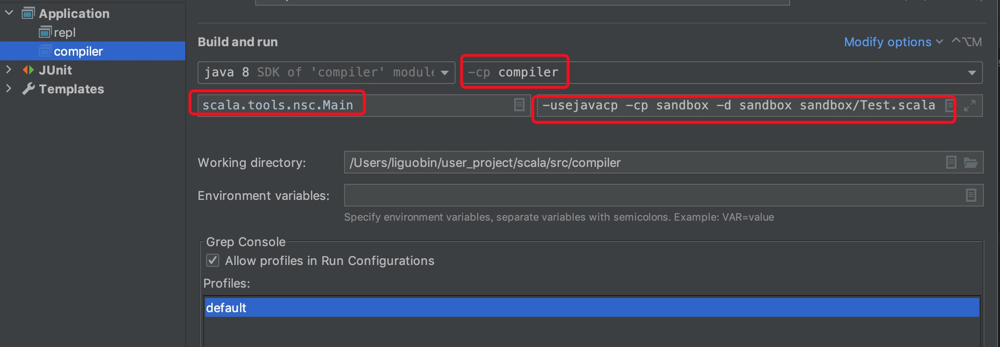

* 目录
{:toc}

1. 确保使用IntelliJ最新版，因为如果不是最新版可能有些特殊的Bug，对于新人来说，为了减少不必要的麻烦，最好使用最新版。
2. 确保安装了IntelliJ的Scala插件，最好也是最新的。
3. 自己最好已经熟悉常见的Git命令，以及开源项目的常见操作。如果不会用的时候谷歌可以。
4. 确保自己已经对scala语法有一定的认识，并有实际工程经验，这很重要。
5. 不要试图将从github clone下来的scala项目直接使用sbt导入到IntelliJ；这条路是完全行不通的，不要浪费时间。
6. **clone项目后，执行sbt intellij，生成IntelliJ所需的结构文件`*.iml`，这些结构文件是从模板文件`src/intellij/*.SAMPLE`中渲染得出的，并且都会被git忽略，通常不需要再关心。**
7. **使用IntelliJ打开scala的`src/intellij/scala.ipr`文件，等待项目索引完成，执行IntelliJ的`Build Project`。（Project Structure中的Project SDK设置为Java 1.8）**
8. **运行编译器，配置一个IntelliJ application，用来本地启动编译器程序，配置如下：。`Test.scala`表示需测试的scala代码，其位置在`src/compiler/sandbox/Test.scala`，这个需要自己创建。通常修改编译器的代码后，需要使用一些case来看看编译器的结果，这比写单测快，同时还可以debug。**
9. 遇到类/方法找不到或者编译错误时，重新执行`sbt restarrFull`和IntelliJ的`Build Project`
10. 遇到解决不了的问题或者疑问，可以在issue下艾特相关维护人员，或者向 `https://gitter.im/scala/contributors` 提问，用英语描述清楚自己的环境和问题，通常都会得到解决。 
11. 在 [scala/bug](https://github.com/scala/bug) 查找自己有意去解决的问题，有可能是feature，有可能是bug，并且都会标记与那些模块相关，尽量寻找 `good first issue` 和 `help wanted` 的，这些通常容易解决（仅是可能，并非一定）。不要找含有`has pr`标记的，这表明已经有人在处理该issue。
12. 处理之前询问维护者是否有人已经开始或者存在被assign的人，是否已经放弃了工作。有时issue下面有很多评论，但可能并没有人开始处理。
13. 大的修改之前应当在[contributors](https://contributors.scala-lang.org)发起相关讨论，这会使得方案被多数人接收，或者会有人提议出更好的设计方案。
14. **issue中那些被标记为`backend`，`bytecode`，`java interop`的，通常与编译器和字节码有关，可能难度比较大。**
15. **任何修改均需要编写单测，个别特殊的经过维护者允许即可，通常维护者也会艾特志愿者来测试。**
16. 不要对现有代码的导入进行格式化或者修改，这没有必要。通常代码应该越简洁越好，通常不应该在核心模块引入外部依赖，如有需要最好自己实现同等功能。
17. 编写函数时要特别注意函数的作用域，不该看见该函数的类或包不应看见该函数。
18. 使用Junit编写测试时可以在本地调试，而有些测试并不能调试。
19. 多看别人的PR，会有很多好的编码风格和设计思想。对于自己的PR，耐心解决别人的comment，如果不想接受别人的建议则应该给出合理的回答以说服维护者。