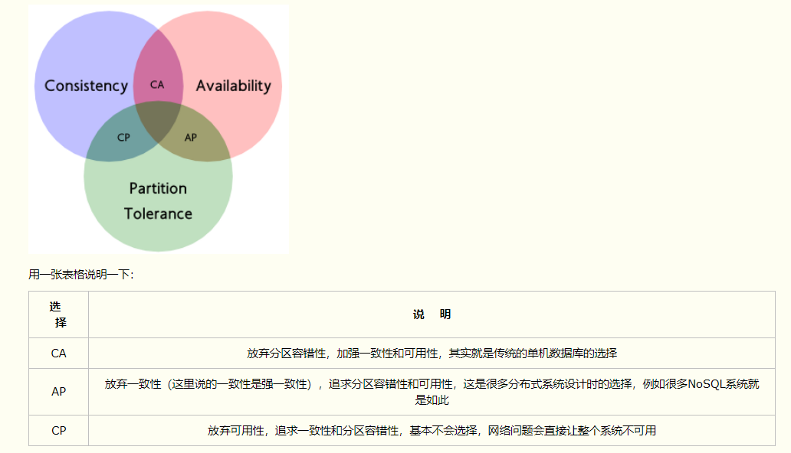
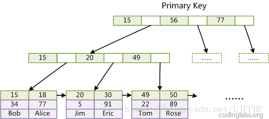
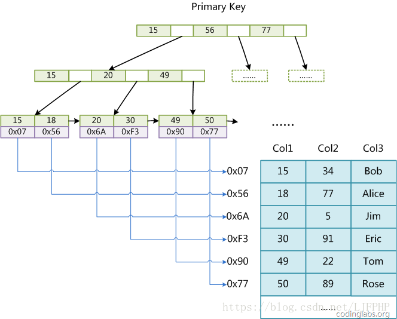

* 目录
{:toc}

### ACID

* 原子性(Atomicity) 原子性是指事务是一个不可分割的工作单位，事务中的操作要么都发生，要么都不发生。 
* 一致性(Consistency) 如果事务执行之前数据库是一个完整性的状态，那么事务结束后，无论事务是否执行成功，数据库仍然是一个完整性状态。（数据库的完整性状态 - 当一个数据库中的所有的数据都符合数据库中所定义的所有的约束，此时可以称数据库是一个完整性状态。）
* 隔离性(Isolation) 事务的隔离性是指多个用户并发访问数据库时，一个用户的事务不能被其它用户的事务所干扰，多个并发事务之间数据要相互隔离。
* 持久性(Durability) 持久性是指一个事务一旦被提交，它对数据库中数据的改变就是永久性的，接下来即使数据库发生故障也不应该对其有任何影响。

关系型数据库和非关系型数据库区别？

下面这些优缺点并非绝对的

**优点**

* 成本：nosql数据库简单易部署，基本都是开源软件，不需要像使用oracle那样花费大量成本购买使用，相比关系型数据库价格便宜。当然还有免费的
* 查询速度：nosql数据库将数据存储于缓存之中，关系型数据库将数据存储在硬盘中，自然查询速度远不及nosql数据库。（速度与存储结构有很多关系）
* 存储数据的格式：nosql的存储格式是key，value形式、文档形式、图片形式等等，所以可以存储基础类型以及对象或者是集合等各种格式，而数据库则只支持基础类型（也有支持复杂类型的）。
* 扩展性：关系型数据库有类似join这样的多表查询机制的限制导致扩展很艰难。

**缺点**

* 维护的工具和资料有限，因为nosql是属于新的技术，不能和关系型数据库10几年的技术同日而语。
* 不提供对sql的支持，如果不支持sql这样的工业标准，将产生一定用户的学习和使用成本。
* 不提供关系型数据库对事物的处理。即：无ACID特性。

**非关系型数据库的优势**

* 性能NOSQL是基于键值对的，可以想象成表中的主键和值的对应关系，而且不需要经过SQL层的解析，所以性能非常高。
* 可扩展性同样也是因为基于键值对，数据之间没有耦合性，所以非常容易水平扩展。

**关系型数据库的优势**

* 复杂查询可以用SQL语句方便的在一个表以及多个表之间做非常复杂的数据查询。
* 事务支持使得对于安全性能很高的数据访问要求得以实现。对于这两类数据库，对方的优势就是自己的弱势，反之亦然。

CAP 分布式系统不可能同时满足一致性（C：Consistency）、可用性（A：Availability）和分区容忍性（P：Partition Tolerance），最多只能同时满足其中两项

	dubbo+zookeeper 主要实现CP 
	springcloud eureka [hystrix] 主要实现AP 
	以上与服务注册细节相关
	

	
BASE 是基本可用（Basically Available）、软状态（Soft State）和最终一致性（Eventually Consistent）三个短语的缩写。
BASE 理论是对 CAP 中一致性和可用性权衡的结果，它的理论的核心思想是：即使无法做到强一致性，但每个应用都可以根据自身业务特点，采用适当的方式来使系统达到最终一致性。

两阶段提交 在分布式系统的提交阶段之前增加了准备阶段，事务中多个资源在准备阶段均成功后，才允许事务提交，否则回滚所有资源。

更多原理具体参考《大型网站系统与Java中间件实战》、《大型网站技术架构 核心原理与案例分析》、《从Paxos到ZooKeeper》

### 数据库隔离级别

SQL标准定义了4类隔离级别，包括了一些具体规则，用来限定事务内外的哪些改变是可见的，哪些是不可见的。低级别的隔离级一般支持更高的并发处理，并拥有更低的系统开销。

* Read Uncommitted（读取未提交内容 - 浏览访问）

在该隔离级别，所有事务都可以看到其他未提交事务的执行结果。本隔离级别很少用于实际应用，因为它的性能也不比其他级别好多少。读取未提交的数据，也被称之为脏读（Dirty Read）。

* Read Committed（读取提交内容 - 游标稳定）

这是大多数数据库系统的默认隔离级别（但不是MySQL默认的）。它满足了隔离的简单定义：一个事务只能看见已经提交事务所做的改变。
这种隔离级别也支持所谓的不可重复读（Nonrepeatable Read），因为同一事务的其他实例在该实例处理其间可能会有新的commit，所以同一select可能返回不同结果。

* Repeatable Read（可重读 - 2.99990度隔离）

这是MySQL的默认事务隔离级别，它确保同一事务的多个实例在并发读取数据时，会看到同样的数据行。不过理论上，这会导致另一个棘手的问题：幻读 （Phantom Read）。
简单的说，幻读指当用户读取某一范围的数据行时，另一个事务又在该范围内插入了新行，当用户再读取该范围的数据行时，会发现有新的“幻影” 行。
InnoDB和Falcon存储引擎通过多版本并发控制（MVCC，Multiversion Concurrency Control）机制解决了该问题。

* Serializable（可串行化 - 隔离、3度隔离）

这是最高的隔离级别，它通过强制事务排序，使之不可能相互冲突，从而解决幻读问题。简言之，它是在每个读的数据行上加上共享锁。在这个级别，可能导致大量的超时现象和锁竞争。
这四种隔离级别采取不同的锁类型来实现，若读取的是同一个数据的话，就容易发生问题。

* 脏读(Drity Read) - 某个事务已更新一份数据，另一个事务在此时读取了同一份数据，由于某些原因，前一个RollBack了操作，则后一个事务所读取的数据就会是不正确的。
* 不可重复读(Non-repeatable read) - 在一个事务的两次查询之中数据不一致，这可能是两次查询过程中间插入了一个事务，更新了原有的数据。
* 幻读(Phantom Read) - 在一个事务的两次查询中数据笔数不一致，例如有一个事务查询了几行(Row)数据，而另一个事务却在此时插入了新的几行数据，先前的事务在接下来的查询中，就会发现有几行数据是它先前所没有的。

* 读不影响写 - 事务以排他锁的形式修改原始数据，读时不加锁，因为 MySQL 在事务隔离级别Read committed 、Repeatable Read下，InnoDB 存储引擎采用非锁定性一致读－－即读取不占用和等待表上的锁。即采用的是MVCC中一致性非锁定读模式。
因读时不加锁，所以不会阻塞其他事物在相同记录上加 X锁来更改这行记录。
* 写不影响读 - 事务以排他锁的形式修改原始数据，当读取的行正在执行 delete 或者 update 操作，这时读取操作不会因此去等待行上锁的释放。相反地，InnoDB 存储引擎会去读取行的一个快照数据。

* 间隙锁 - 间隙锁主要用来防止幻读，用在repeatable-read隔离级别下，指的是当对数据进行条件，范围检索时，对其范围内也许并存在的值进行加锁！
当查询的索引含有唯一属性（唯一索引，主键索引）时，InnoDB存储引擎会对next-key lock进行优化，将其降为record lock，即仅锁住索引本身，而不是范围！若是普通辅助索引，则会使用传统的next-key lock进行范围锁定！
 
### 锁算法

* Record Lock：单个行记录上的锁。
* Gap Lock：间隙锁，锁定一个范围，但不包括记录本身。GAP锁的目的，是为了防止同一事务的两次当前读，出现幻读的情况。
* Next-Key Lock：Record + Gap，锁定一个范围，并且锁定记录本身。对于行的查询，都是采用该方法，主要目的是解决幻读的问题。

### MVCC

MVCC的全称是“多版本并发控制”。这项技术使得InnoDB的事务隔离级别下执行一致性读操作有了保证，换言之，就是为了查询一些正在被另一个事务更新的行，并且可以看到它们被更新之前的值。
这是一个可以用来增强并发性的强大的技术，因为这样一来的话查询就不用等待另一个事务释放锁。这项技术在数据库领域并不是普遍使用的。一些其它的数据库产品，以及MySQL其它的存储引擎并不支持它。

MySQL的InnoDB采用的是行锁，而且采用了多版本并发控制来提高读操作的性能。

**什么是多版本并发控制**

其实就是在每一行记录的后面增加两个隐藏列，记录创建版本号和删除版本号，而每一个事务在启动的时候，都有一个唯一的递增的版本号。 
在InnoDB中，给每行增加两个隐藏字段来实现MVCC，两个列都用来存储事务的版本号，每开启一个新事务，事务的版本号就会递增。

**默认的隔离级别（REPEATABLE READ）**

- SELECT 读取创建版本小于或等于当前事务版本号，并且删除版本为空或大于当前事务版本号的记录。这样可以保证在读取之前记录是存在的
- INSERT 将当前事务的版本号保存至行的创建版本号
- UPDATE 新插入一行，并以当前事务的版本号作为新行的创建版本号，同时将原记录行的删除版本号设置为当前事务版本号
- DELETE 将当前事务的版本号保存至行的删除版本号

**什么是快照读和当前读**
	
- 快照读：读取的是快照版本，也就是历史版本
- 当前读：读取的是最新版本

普通的SELECT就是快照读，而UPDATE、DELETE、INSERT、SELECT …  LOCK IN SHARE MODE、SELECT … FOR UPDATE是当前读。

**什么是锁定读**

在一个事务中，标准的SELECT语句是不会加锁，但是有两种情况例外。
- SELECT ... LOCK IN SHARE MODE 给记录加上共享锁，这样一来的话，其它事务只能读不能修改，直到当前事务提交
- SELECT ... FOR UPDATE 给索引记录加锁，这种情况下跟UPDATE的加锁情况是一样的

**什么是一致性非锁定读**

consistent read （一致性读），InnoDB用多版本来提供查询数据库在某个时间点的快照。如果隔离级别是REPEATABLE READ，那么在同一个事务中的所有一致性读都读的是事务中第一个这样的读读到的快照；
如果是READ COMMITTED，那么一个事务中的每一个一致性读都会读到它自己刷新的快照版本。Consistent read（一致性读）是READ COMMITTED和REPEATABLE READ隔离级别下普通SELECT语句默认的模式。
一致性读不会给它所访问的表加任何形式的锁，因此其它事务可以同时并发的修改它们。

MVCC实现一致性非锁定读，这就有保证在同一个事务中多次读取相同的数据返回的结果是一样的，解决了不可重复读的问题。

**什么是悲观锁和乐观锁**

- 悲观锁 正如它的名字那样，数据库总是认为别人会去修改它所要操作的数据，因此在数据库处理过程中将数据加锁。其实现依靠数据库底层。
- 乐观锁 如它的名字那样，总是认为别人不会去修改，只有在提交更新的时候去检查数据的状态。通常是给数据增加一个字段来标识数据的版本。
	
**select时怎么加排它锁**

使用锁定读，普通select不会引起加锁，而是去读取最新的快照。同上4
事务以排他锁的形式修改原始数据，当读取的数据正在进行更新等操作，则直接去读取快照，而不是等锁释放

### MyISAM和InnoDB

**MyISAM**
	
* 不支持事务，但是每次查询都是原子的；
* 支持表级锁，即每次操作是对整个表加锁；
* 存储表的总行数；
* 一个MyISAM表有三个文件：索引文件、表结构文件、数据文件；
* 采用非聚集索引，索引文件的数据域存储指向数据文件的指针。辅索引与主索引基本一致，但是辅索引不用保证唯一性；
* 适用OLAP。

**InnoDB**

* 支持ACID的事务，支持事务的四种隔离级别；
* 支持行级锁及外键约束：因此可以支持写并发；
* 不存储总行数；
* 一个InnoDB引擎存储在一个文件空间（共享表空间，表大小不受操作系统控制，一个表可能分布在多个文件里），也有可能为多个（设置为独立表空间，表大小受操作系统文件大小限制，一般为2G），受操作系统文件大小的限制；
* 主键索引采用聚集索引（索引的数据域存储数据文件本身），辅索引的数据域存储主键的值；因此从辅索引查找数据，需要先通过辅索引找到主键值，再访问辅索引；
* 最好使用自增主键，防止插入数据时，为维持B+树结构，文件的大调整；
* 适用OLTP。

**InnoDB主要特性**

主要包括：插入缓存（insert buffer）、两次写(double write)、自适应哈希(Adaptive Hash index)、异步IO(Async IO)、刷新邻接页(Flush Neighbor Page)

感兴趣可以参考书籍《MySQL技术内幕:InnoDB存储引擎》
网上找了一个博客[InnoDB关键特性](https://blog.csdn.net/MySQL_lover/article/details/54617765)

### 索引有B+索引和hash索引

**主要区别**

* 如果是等值查询，那么哈希索引明显有绝对优势，因为只需要经过一次算法即可找到相应的键值；当然了，这个前提是，键值都是唯一的。如果键值不是唯一的，就需要先找到该键所在位置，然后再根据链表往后扫描，直到找到相应的数据；
* 如果是范围查询检索，这时候哈希索引就毫无用武之地了，因为原先是有序的键值，经过哈希算法后，有可能变成不连续的了，就没办法再利用索引完成范围查询检索；
* 同理，哈希索引也没办法利用索引完成排序，以及like ‘xxx%’ 这样的部分模糊查询（这种部分模糊查询，其实本质上也是范围查询）；
* 哈希索引也不支持多列联合索引的最左匹配规则；
* B+树索引的关键字检索效率比较平均，不像B树那样波动幅度大，在有大量重复键值情况下，哈希索引的效率也是极低的，因为存在所谓的哈希碰撞问题。

### 为什么B+树适合作为索引的结构？

* B树：有序数组+平衡多叉树
* B+树：有序数组链表+平衡多叉树  叶子存储数据，空间占用小，且是双链表，修改效率快
* 不同于B树只适合随机检索，B+树同时支持随机检索和顺序检索

**k近邻算法**

* kd树是一种对k维空间中的实例点进行存储以便对其进行快速检索的树形数据结构，且kd树是一种二叉树，表示对k维空间的一个划分。

**伸展树**

* 伸展树（Splay Tree），也叫分裂树，是一种二叉排序树，它能在O(log n)内完成插入、查找和删除操作
* 在伸展树上的一般操作都基于伸展操作：假设想要对一个二叉查找树执行一系列的查找操作，为了使整个查找时间更小，被查频率高的那些条目就应当经常处于靠近树根的位置。
* 于是想到设计一个简单方法， 在每次查找之后对树进行重构，把被查找的条目搬移到离树根近一些的地方。伸展树应运而生。伸展树是一种自调整形式的二叉查找树，它会沿着从某个节点到树根之间的路径，
通过一系列的旋转把这个节点搬移到树根去。
它的优势在于不需要记录用于平衡树的冗余信息。

数据库索引采用B+树的主要原因是B树在提高了磁盘IO性能的同时并没有解决元素遍历的效率低下的问题。
正是为了解决这个问题，B+树应运而生。B+树只要遍历叶子节点就可以实现整棵树的遍历。而且在数据库中基于范围的查询是非常频繁的，而B树不支持这样的操作（或者说效率太低）。

平衡二叉树没能充分利用磁盘预读功能，而B树是为了充分利用磁盘预读功能来而创建的一种数据结构，也就是说B树就是为了作为索引才被发明出来的的。

**局部性原理与磁盘预读**

* 由于存储介质的特性，磁盘本身存取就比主存慢很多，再加上机械运动耗费，磁盘的存取速度往往是主存的几百分分之一，因此为了提高效率，要尽量减少磁盘I/O。
为了达到这个目的，磁盘往往不是严格按需读取，而是每次都会预读，即使只需要一个字节，磁盘也会从这个位置开始，顺序向后读取一定长度的数据放入内存。这样做的理论依据是计算机科学中著名的局部性原理： 
* 当一个数据被用到时，其附近的数据也通常会马上被使用。 
程序运行期间所需要的数据通常比较集中。 
由于磁盘顺序读取的效率很高（不需要寻道时间，只需很少的旋转时间），因此对于具有局部性的程序来说，预读可以提高I/O效率。

**为什么说红黑树没能充分利用磁盘预读功能**

* 红黑树这种结构，h明显要深的多。由于逻辑上很近的节点（父子）物理上可能很远，无法利用局部性，所以红黑树的I/O渐进复杂度也为O(h)，效率明显比B-Tree差很多。
* 也就是说，使用红黑树（平衡二叉树）结构的话，每次磁盘预读中的很多数据是用不上的数据。因此，它没能利用好磁盘预读的提供的数据。然后又由于深度大（较B树而言），所以进行的磁盘IO操作更多。

* 树形结构使用C语言的指针实现（指针保存的就是节点的物理地址），层级之间是使用指针指向子节点，也就是随机IO，因此深度越大，IO越多。
而在B+树中，叶子之间还使用了双链表连接，并且同层叶子的数据是有序的，因此可以通过顺序向前后进行查询，而不需要通过其他父节点的寻址再找到叶子节点。

### B+和B树的区别

除了以上的，主要区别，其他请看 [B- B+ B\*树](https://blog.csdn.net/qq_29501587/article/details/52184370)
实际上B-就是B树，二叉树不叫B树，像这种写法B-Tree，可以是B-树也可以说是B树（-可能是连接符，可能是翻译问题），B+ B\* 是改善的B树

* MyISAM和InnoDB都使用了B+树作为索引存储结构，但是叶子上数据的存储方式不同。前者索引文件和数据文件是分离的，索引文件仅保存记录所在页的指针（物理位置），
而后者直接存储数据，或者存储主键值（存储主键值并检索辅助索引，此时实际上进行了二次查询，增加IO次数）。

InnoDB：

MyISAM：

### 索引的分类（主键索引、唯一索引），最左前缀原则，哪些情况索引会失效？

**各种索引区别**
	
- 普通索引：最基本的索引，没有任何限制。
- 唯一索引：与“普通索引”类似，不同的就是：索引列的值必须唯一，但允许有空值。
- 主键索引：它 是一种特殊的唯一索引，不允许有空值。 
- 全文索引：仅可用于 MyISAM 表，针对较大的数据，生成全文索引很耗时耗空间。（MATCH... AGAINST...） 
- 组合索引：为了更多的提高MySQL效率可建立组合索引，遵循“最左前缀”原则。
- 覆盖索引：包含（覆盖）所有需要查询的字段的值的索引

**ElasticSearch、Lucene中的倒排索引**

* 倒排索引(Inverted Index)：倒排索引是实现“单词-文档矩阵”的一种具体存储形式，通过倒排索引，可以根据单词快速获取包含这个单词的文档列表。倒排索引主要由两个部分组成：“单词词典”和“倒排文件”。
* 单词词典(Lexicon)：搜索引擎的通常索引单位是单词，单词词典是由文档集合中出现过的所有单词构成的字符串集合，单词词典内每条索引项记载单词本身的一些信息以及指向“倒排列表”的指针。
* 倒排文件(Inverted File)：所有单词的倒排列表往往顺序地存储在磁盘的某个文件里，这个文件即被称之为倒排文件，倒排文件是存储倒排索引的物理文件。
* 倒排列表(PostingList)：倒排列表记载了出现过某个单词的所有文档的文档列表及单词在该文档中出现的位置信息，每条记录称为一个倒排项(Posting)。根据倒排列表，即可获知哪些文档包含某个单词。

倒排索引基本概念示意图

**倒排索引和正排索引**

- 倒排索引：索引词->网页
- 正排索引：网页->索引词

假设使用正向索引，那么当你搜索“SEO”的时候，搜索引擎必须检索网页中的每一个关键词，假设一个网页中包含成千上百个关键词，可想而知，会造成大量的资源浪费。于是倒排索引应运而生。倒排索引是相对正向索引而言的，你也可以将其理解为逆向索引。
比如你搜索“SEO”，搜索引擎可以快速检索出包含“SEO”搜索词的网页1和网页2，为后续的相关度和权重计算奠定基础，从而大大加快了返回搜索结果的速度。

### 聚集索引和非聚集索引
	
**聚集（clustered）索引，也叫聚簇索引**

定义：数据行的物理顺序与列值（一般是主键的那一列）的逻辑顺序相同，一个表中只能拥有一个聚集索引。
如果没定义主键，会选择一个唯一的非空索引代替，如果没有这样的索引，则会隐式定义一个主键作为聚簇索引

**非聚集（unclustered）索引**

定义：该索引中索引的逻辑顺序与磁盘上行的物理存储顺序不同，一个表中可以拥有多个非聚集索引。

使用聚集索引的查询效率要比非聚集索引的效率要高，但是如果需要频繁去改变聚集索引的值，写入性能并不高，因为需要移动对应数据的物理位置。
非聚集索引在查询的时候可以的话就避免二次查询，这样性能会大幅提升。不是所有的表都适合建立索引，只有数据量大表才适合建立索引，且建立在选择性高的列上面性能会更好。重复度高的可能使得索引失效。
	
### 表结构对性能的影响

**冗余数据的处理**

* 适当的数据冗余可以提高系统的整体查询性能(在P2P中，在userinfo对象中有realname和idnumber);
* 关系数据库的三范式:
* 第一范式（1NF）是对关系模式的基本要求，不满足第一范式（1NF）的数据库就不是关系数据库，是指数据库表的每一列都是不可分割的基本数据项，同一列中不能有多个值；
* 第二范式（2NF）要求数据库表中的每个实例或行必须可以被惟一地区分。  即各字段和主键之间不存在部分依赖
* 第三范式（3NF）要求一个数据库表中不包含已在其它表中已包含的非主关键字信息。即在第二范式的基础上，不存在传递依赖 (不允许有冗余数据) 

**大表拆小表，有大数据的列单独拆成小表**

* 在一个数据库中，一般不会设计属性过多的表;
* 在一个数据库中，一般不会有超过500/1000万数据的表(拆表，按照逻辑拆分，按照业务拆分);
* 有大数据的列单独拆成小表(富文本编辑器，CKeditor);

**根据需求的展示设置更合理的表结构**

**把常用属性分离成小表**

* 在P2P项目中，我们把logininfo和userinfo和account表拆成了三张表;
* 减少查询常用属性需要查询的列;
* 便于常用属性的集中缓存;

### 数据库的主从复制

- 就算MySQL拆成了多个，也必须分出主和从，所有的写操作都必须要在主MySQL 上完成;
- 所有的从MySQL的数据都来自于(同步于)主MySQL;
- 既然涉及到同步，那一定有延迟;有延迟，就一定可能在读的时候产生脏数据;所以，能够在从MySQL上进行的读操作，一定对实时性和脏数据有一定容忍度的数据;比如，登陆日志，后台报表，首页统计信息来源;文章;资讯;SNS消息;
- 在我们的P2P中，做主从，绝大部分的读操作，都必须在主MySQL上执行;只有(登陆日志，报表，满标一审列表，满标二审列表，用户的流水信息，充值明细，投标明细查询类的业务可以定位到从MySQL);
- 【一定注意】：在MySQL主从时，如果一个业务(service中的一个方法)中，如果既有R操作，又有W操作，因为W操作一定要在主MySQL上，所以在一个事务中所有的数据来源都只能来自于一个MySQL

1. 要完成主从同步，就必须让在Master上执行的所有的DML和DDL能够正确的在Salve上再执行一遍;MySQL选择使用文件来记录SQL;
2. 要完成主从同步，第一个事情就是把在主服务器上的bin-log(二进制文件)打开，bin-log文件就可以记录在MySQL上执行的所有的DML+DDL+TCL;
3. MySQL使用被动注册的方式来让从MySQL请求同步主MySQL的binlog;原因:被动请求的方式，主的MySQL不需要知道有哪些从的MySQL，我额外添加/去掉从MySQL服务器，对主MySQL服务器的正常运行没有任何影响;
4. 第二步，从MySQL后台一个线程发送一个请求，到主服务器请求更新数据;最重要的数据(我这次请求，请求你bin-log的哪一行数据之后的数据)
5. 第三步，主MySQL后台一个线程接收到从MySQL发送的请求，然后读取bin-log文件中指定的内容，并放在从MySQL的请求响应中;
6. 第四步，从MySQL的请求带回同步的数据，然后写在从MySQL中的relay-log(重做日志)中;relay-log中记录的就是从主MySQL中请求回来的哪些SQL数据;
7. 第五步，从MySQL后台一个线程专门用于从relay-log中读取同步回来的SQL，并写入到从MySQL中，完成同步;
8. MySQL的主从同步是经过高度优化的，性能非常高;

**status是执行SQL的详细过程**

* Duration：执行的具体时间
* CPU_user：用户CPU时间
* CPU_system：系统CPU时间
* Block_ops_in：IO输入次数
* Block_ops_out：IO输出次数
* profiling只对本次会话有效

**JOIN的原理**

在MySQL中使用Nested Loop Join来实现join；
A JOIN B：通过A表的结果集作为循环基础，一条一条的通过结果集中的数据作为过滤条件到下一个表中查询数据，然后合并结果；

**JOIN的优化原则**

1. 尽可能减少Join 语句中的Nested Loop 的循环总次数，用小结果集驱动大结果集；
2. 优先优化Nested Loop 的内层循环；
3. 保证Join 语句中被驱动表上Join 条件字段已经被索引；
4. 扩大join buffer的大小；

### 内连接、外连接、交叉连接、笛卡儿积等

1. 内连接 只有两个表相匹配的行才能在结果集中出现
    - 等值连接
    - 自然连接
    - 不等连接
2. 外连接
    - 左外连接(LEFT OUTER JOIN或LEFT JOIN)  以左边为准，右边没用则为空
    - 右外连接(RIGHT OUTER JOIN或RIGHT JOIN) 以右边为准，左边没有则为空 
    - 全外连接(FULL OUTER JOIN或FULL JOIN)  左右均可能为空
3. 交叉连接 没有WHERE 子句，它返回连接表中所有数据行的笛卡尔积
4. 笛卡儿积

### 死锁怎么解决？

**产生死锁的原因主要是**

1. 系统资源不足。
2. 进程运行推进的顺序不合适。
3. 资源分配不当等。

如果系统资源充足，进程的资源请求都能够得到满足，死锁出现的可能性就很低，否则就会因争夺有限的资源而陷入死锁。其次，进程运行推进顺序与速度不同，也可能产生死锁。

**产生死锁的四个必要条件**
	
- 互斥条件：一个资源每次只能被一个进程使用。
- 请求与保持条件：一个进程因请求资源而阻塞时，对已获得的资源保持不放。
- 不剥夺条件:进程已获得的资源，在末使用完之前，不能强行剥夺。
- 循环等待条件:若干进程之间形成一种头尾相接的循环等待资源关系。

这四个条件是死锁的必要条件，只要系统发生死锁，这些条件必然成立，而只要上述条件之一不满足，就不会发生死锁。

**死锁的预防和解除**

理解了死锁的原因，尤其是产生死锁的四个必要条件，就可以最大可能地避免、预防和解除死锁。所以，在系统设计、进程调度等方面注意如何不让这四个必要条件成立，如何确定资源的合理分配算法，避免进程永久占据系统资源。此外，也要防止进程在处于等待状态的情况下占用资源，在系统运行过程中，对进程发出的每一个系统能够满足的资源申请进行动态检查，并根据检查结果决定是否分配资源，若分配后系统可能发生死锁，则不予分配，否则予以分配 。因此，对资源的分配要给予合理的规划。
如何将死锁减至最少

虽然不能完全避免死锁，但可以使死锁的数量减至最少。将死锁减至最少可以增加事务的吞吐量并减少系统开销，因为只有很少的事务回滚，而回滚会取消事务执行的所有工作。由于死锁时回滚而由应用程序重新提交。

**下列方法有助于最大限度地降低死锁**

* 按同一顺序访问对象。
* 避免事务中的用户交互。
* 保持事务简短并在一个批处理中。
* 使用低隔离级别。
* 使用绑定连接。

**具体**

* 按同一顺序访问对象 如果所有并发事务按同一顺序访问对象，则发生死锁的可能性会降低。例如，如果两个并发事务获得 Supplier 表上的锁，然后获得 Part 表上的锁，则在其中一个事务完成之前，另一个事务被阻塞在 Supplier 表上。第一个事务提交或回滚后，第二个事务继续进行。不发生死锁。将存储过程用于所有的数据修改可以标准化访问对象的顺序。
* 避免事务中的用户交互 避免编写包含用户交互的事务，因为运行没有用户交互的批处理的速度要远远快于用户手动响应查询的速度，例如答复应用程序请求参数的提示。例如，如果事务正在等待用户输入，而用户去吃午餐了或者甚至回家过周末了，则用户将此事务挂起使之不能完成。这样将降低系统的吞吐量，因为事务持有的任何锁只有在事务提交或回滚时才会释放。即使不出现死锁的情况，访问同一资源的其它事务也会被阻塞，等待该事务完成。
* 保持事务简短并在一个批处理中 在同一数据库中并发执行多个需要长时间运行的事务时通常发生死锁。事务运行时间越长，其持有排它锁或更新锁的时间也就越长，从而堵塞了其它活动并可能导致死锁。
保持事务在一个批处理中，可以最小化事务的网络通信往返量，减少完成事务可能的延迟并释放锁。
* 使用低隔离级别 确定事务是否能在更低的隔离级别上运行。执行提交读允许事务读取另一个事务已读取（未修改）的数据，而不必等待第一个事务完成。使用较低的隔离级别（例如提交读）而不使用较高的隔离级别（例如可串行读）可以缩短持有共享锁的时间，从而降低了锁定争夺。
* 使用绑定连接 使用绑定连接使同一应用程序所打开的两个或多个连接可以相互合作。次级连接所获得的任何锁可以象由主连接获得的锁那样持有，反之亦然，因此不会相互阻塞。

### varchar和char的使用场景

**varchar的特点**

* 存储变长字符串，只占用必要的存储空间
* 列的长度小于255，只用额外的1个字节来记录长度
* 列的长度大于255，只用额外的2个字节来记录长度

**char的特点**

* 存储定长字符串，最大为255字节
* 要删除字符串末尾的空格。

### 解决并发的方案

1. 代码中sql语句优化
2. 数据库字段优化，索引优化
3. 加缓存，redis/memcache等
4. 主从，读写分离   集群 分流 横向扩展
5. 分区
6. 垂直拆分，解耦模块
7. 水平切分 分片